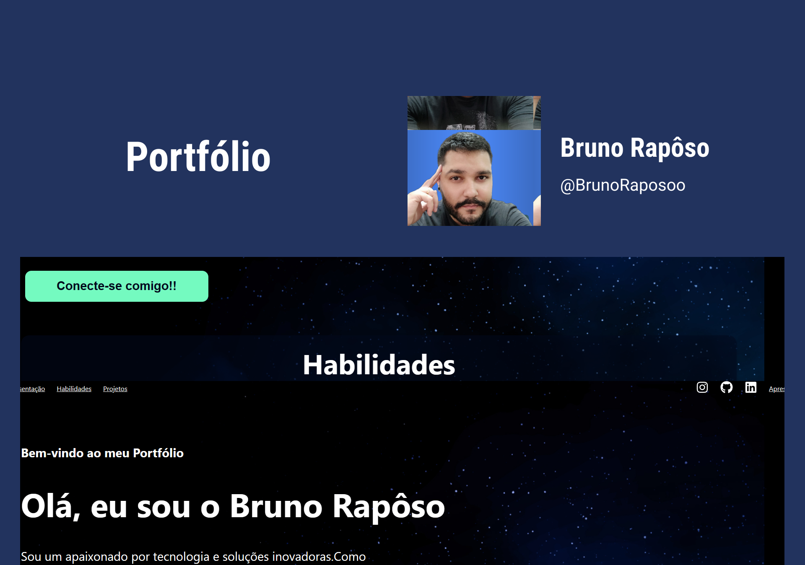

<h1 align="center"> Portfólio - React </h1>

  <a href="#-tecnologias">Tecnologias</a>&nbsp;&nbsp;&nbsp;|&nbsp;&nbsp;&nbsp;
  <a href="#-projeto">Projeto</a>&nbsp;&nbsp;&nbsp;|&nbsp;&nbsp;&nbsp;
  <a href="#-layout">Layout</a>&nbsp;&nbsp;&nbsp

 

  

## 🚀 Tecnologias

Esse projeto foi desenvolvido com as seguintes tecnologias:

- [ReactJS](https://react.dev/)
- [CSS](https://developer.mozilla.org/pt-BR/docs/Learn/Getting_started_with_the_web/CSS_basics)

## 💻 Projeto

Projeto desenvolvido para criar um site portfólio.    
Para acessar o projeto clique [AQUI](https://portfolio-react-dnc-livid.vercel.app/)

## 🔖 Layout

Você pode visualizar o layout do projeto através [DESSE LINK](https://www.figma.com/file/eSXxtUyIh9BDSTi7KRCfBe/React-para-Desenvolvimento-web?type=design&node-id=1-2&mode=design&t=uJJWQZJ29xF4hHGd-0). É necessário ter conta no [Figma](https://figma.com) para acessá-lo.